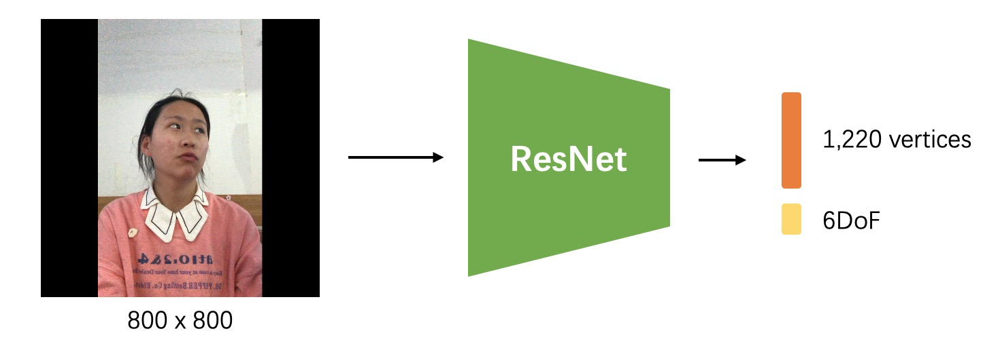
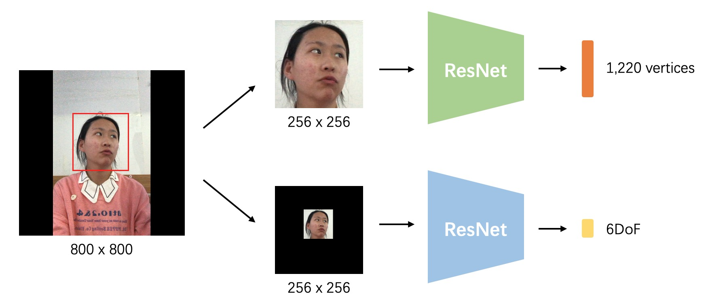

# ECCV2022 WCPA Challenge: From Face, Body and Fashion to 3D Virtual Avatars (Track2)

This repository contains tutorial codes for ["ECCV2022 WCPA Challenge Track2: Perspective Projection Based Monocular 3D Face Reconstruction"](https://tianchi.aliyun.com/competition/entrance/531961/information?spm=5176.12281976.0.0.3136f9319Ifv7e).


## 1. Data preparation

Follow the instructions of the competition website.

Download the data files and unpack them in the same folder as shown below.


```
wcpa_challenge_face_data
   ├─ image (contains 447,185 800x800 .jpg images of both training and test set)
   ├─ 68landmarks (contains 44,7185 .txt files of both training and test set)
   ├─ info (contains 356,640 .npz files of training set)
   ├─ list
   │    ├─ WCPA_track2_train_subject_id_list.txt
   │    ├─ WCPA_track2_test_subject_id_list.txt
   │    ├─ WCPA_track2_train.csv
   │    └─ WCPA_track2_test.csv
   └─ resources
        ├─ example.obj
        ├─ kpt_ind.npy
        ├─ projection_matrix.txt
        └─ example_submission.npy
```


## 2. Understand the data format

Set up python environment.
```bash
conda create -n wcpa_track2 python=3.7
conda activate wcpa_track2
pip install -r requirements.txt
```

The visualization code depends on Sim3DR. Clone the code and compile it. (See https://github.com/cleardusk/3DDFA_V2/tree/master/Sim3DR)

Go to `visualization.ipynb` and learn about the detail of the data format.


## 3. The simplest solution

The simplest solution is to directly regress the 3D vertices and 6DoF (euler angles and translation vector) from the 800x800 image, leading to a score of 200\~300 on the leaderboard. If you are interested, you can implement the solution yourself. Obviously, the performance of this method is very limited.




## 4. Try a quick and effective baseline

We provide a quick and effective baseline as a reference. The intuition is that the face shape should be predicted from local facial region while the 6DoF (euler angles and translation vector) is easier to obtain from the global image. Therefore, we crop the local facial region, resize it to 256x256, and then feed it into the ResNet to predict the 1,220 vertices. In the original 800x800 image, we blacken the region outside the face, then resize the image to 256x256, and feed it to another ResNet to predict 6DOF information. The framework of the baseline is illustrated bellow. 




Please follow the steps to start with.

#### (1) Install torch (>=1.6.0) and torchvision (>=0.7.0) according to [the official website](https://pytorch.org).

#### (2) Split the local training set and validation set.
```
python step01_preparation.py --data_root <Your_Data_Root>
# check the folder named cache
```

#### (3) Start training.
It takes about 6 hours to train on an NVIDIA V100 GPU. Please monitor the loss on the validation set and make sure it is convergent.
```
python step02_train.py --data_root <Your_Data_Root> \
  --name run01 --gpu_ids 0 --memo "first trial"
 ```
There are still many parameters to fine tune. Run `python step02_train.py --help` for more detail.


#### (4) Evaluate on test images.
Before submitting the results, it is best to visualize on the test set in order to judge the performance of your trained model.
```
python step03_eval.py --data_root <Your_Data_Root> \
  --name run01 --gpu_ids 0
# check the visualization in the folder named output
```


#### (5) Make your submission.
```
python step04_make_submission.py --data_root <Your_Data_Root> \
  --name run01 --gpu_ids 0
# check the file located at output/my_submission.npy
```
Zip the npy file and submit it to Tianchi website to get a competitive score on the leaderboard.


#### (6) Improvement.
Participants can improve this baseline from many aspects to achieve better performance (e.g. augmentation, network architecture). And we greatly encourage participants to try some completely different and novel ideas (not just a direct regression method).


####  If you have any questions, please feel free to contact pixelai-3dface@service.alibaba.com / bowen.pbw@alibaba-inc.com.


## Citation
The face data used in this challenge is part of the ARKitFace Dataset in the following paper.
```
@article{kao2022single,
    title={Single-Image 3D Face Reconstruction under Perspective Projection},
    author={Yueying Kao, Bowen Pan, Miao Xu, Jiangjing Lyu, Xiangyu Zhu, Yuanzhang Chang, Xiaobo Li, Zhen Lei, Zixiong Qin},
    journal={arXiv preprint arXiv:2205.04126},
    year={2022}
}
```


## Acknowledgement
Most codes in this program are borrowed from [contrastive-unpaired-translation](https://github.com/taesungp/contrastive-unpaired-translation) and [3DDFA_V2](https://github.com/cleardusk/3DDFA_V2). Thanks to authors of these wonderful projects. 


